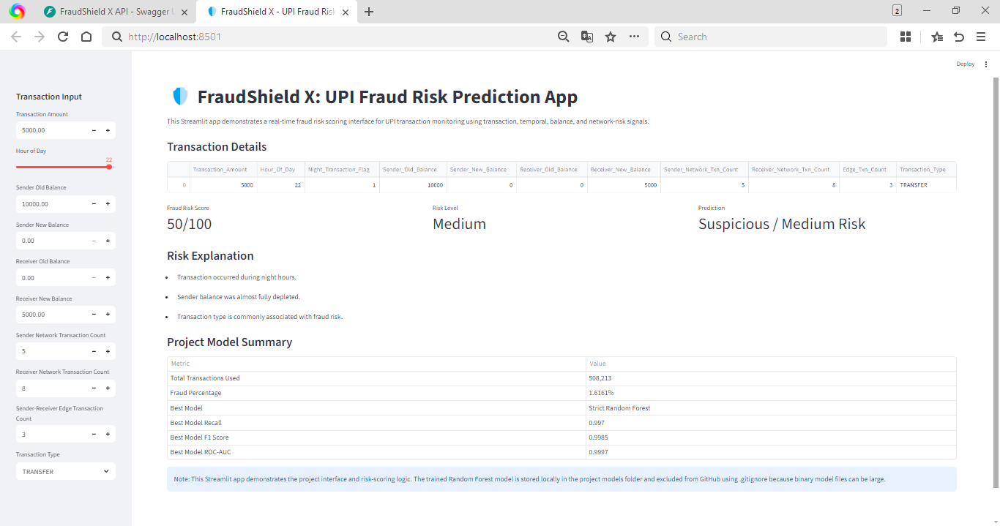
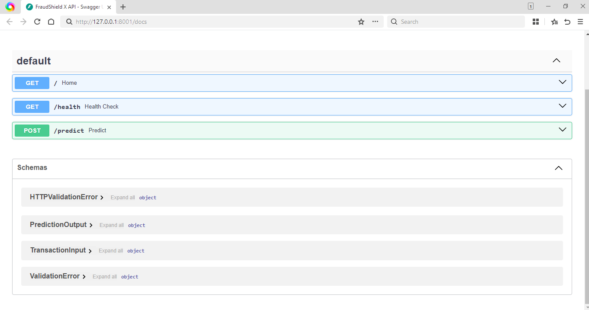
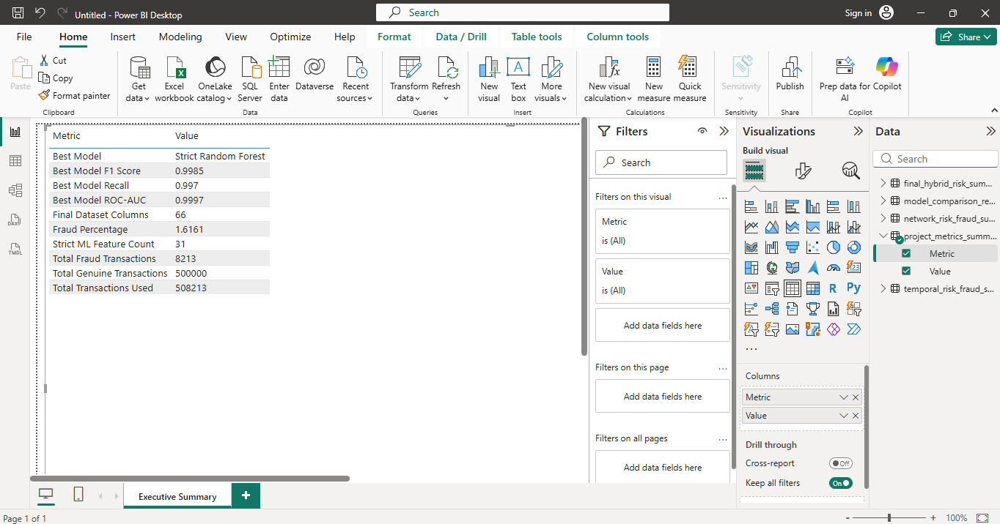
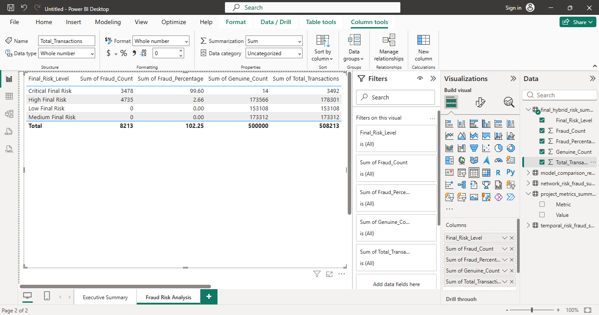

# FraudShield X: UPI Mule Ring Early-Warning System Using Temporal Graph Risk Signals

## Project Overview

FraudShield X is an end-to-end fraud detection and mule-risk intelligence project designed to identify suspicious UPI-style transaction behavior using multi-layer risk signals, machine learning, SQL analytics, web application development, API serving, Docker containerization, and cloud deployment documentation.

The project combines:

- Transaction-level fraud indicators
- Account-level mule-risk features
- Temporal burst-risk signals
- Graph/network relationship features
- Final hybrid risk scoring
- Machine learning fraud classification
- Model interpretation and feature importance
- SQL fraud analytics layer
- Power BI dashboard planning
- Streamlit fraud risk web app
- FastAPI prediction service
- Docker containerization
- Cloud deployment documentation

The goal is to build an early-warning system that can detect high-risk transactions and mule-ring behavior before large-scale fraud escalation.

---

## Live Demo

- Streamlit App: https://fraudshield-x-upi.streamlit.app/
[](https://fraudshield-x-upi.streamlit.app/)

---

## Business Problem

Digital payment fraud is increasing rapidly in instant payment ecosystems. Fraudsters often use mule accounts, repeated sender-receiver patterns, high-value transfers, night transactions, account-draining behavior, and burst activity to hide fraudulent movement of funds.

FraudShield X is designed to help financial platforms:

- Detect suspicious transactions early
- Identify high-risk sender and receiver accounts
- Monitor mule-account behavior
- Analyze temporal and network-based fraud patterns
- Provide explainable risk scoring
- Support real-time fraud-risk prediction
- Enable dashboard-based fraud monitoring

---

## Dataset

- 508,213 final sampled transactions
- 500,000 genuine transactions
- 8,213 fraud transactions
- 1.6161% fraud rate
- 31 strict no-leakage ML features
- 66 final dataset columns

---

## Project Architecture

```text
Raw UPI-Style Transaction Data
        |
        v
Data Cleaning & EDA
        |
        v
Feature Engineering
(Transaction + Account + Temporal + Network Features)
        |
        v
Risk Layer Creation
(Transaction Risk + Mule Risk + Temporal Risk + Network Risk + Hybrid Risk)
        |
        v
Strict No-Leakage ML Training
(Logistic Regression + Random Forest)
        |
        v
Model Evaluation & Feature Importance
        |
        v
SQL Fraud Analytics Layer
        |
        v
Power BI Dashboard Planning
        |
        v
Streamlit Fraud Risk Web App
        |
        v
FastAPI Prediction Service
        |
        v
Docker Containerization
        |
        v
Cloud Deployment Documentation

-----------------------
## Project Screenshots
-----------------------
### Streamlit Live App


### FastAPI Swagger Documentation


### Power BI Executive Summary Dashboard


### Power BI Fraud Risk Analysis Dashboard
